# Shui Pretty PPT

一套面向 Codex / Claude Code 等 Coding Agent 的可复用 **HTML 网页 PPT 技能**。

它的目标不是生成普通网页，而是把笔记、文档、教程、复盘、汇报、演讲提纲和飞书文档内容，转成可以直接打开、展示、分享或部署的高完成度网页 PPT。

当前内置 12 套视觉模板，分为两个模块：

## Module A · 自媒体 / 个人展示 / 作品集

适合更活泼、更有记忆点、更适合对外分享的内容。

- **Pastel Blockfolio / 粉彩拼贴志**：教程、案例、流程复盘、自媒体选题说明。
- **Blush Editorial / 暖粉编辑志**：品牌内容页、推荐清单、工具目录、编辑感长页面。
- **Mono Curve Slides / 墨线白稿**：动态幻灯片、课程说明、产品更新、轻量演示页。
- **Ribbon Tab Brochure / 彩签页报**：项目资料册、产品说明、运营复盘、对外提案。
- **Blue Growth Deck / 蓝色增长稿**：AI 产品、运营增长、GEO 复盘、轻商务互动演示。
- **Garden Pop Landing / 花园跳色长页**：自媒体教程、课程产品、创作者产品发布、轻快产品长页。

## Module B · 行政政务 / 职场汇报 / 产品演讲

适合更实用、更正式、更偏工作交付的演示场景。

- **One Dot Cinnabar / 一点丹红**：年终总结、工作汇报、项目复盘、正式演讲。
- **Ivory Research Deck / 象牙研稿**：学术汇报、研究总结、职场简报、产品调研。
- **Cobalt Executive Deck / 钴蓝商策**：商务汇报、产品介绍、公司介绍、合作提案。
- **Coral Startup Deck / 珊瑚企简**：公司介绍、项目汇报、团队路演、工作计划。
- **Sapphire Defense Deck / 宝蓝答辩稿**：论文答辩、学术汇报、研究总结、正式项目复盘。
- **Vermilion Civic Deck / 红色汇报稿**：政务工作、行政汇报、党建材料、公共服务项目总结。

## Preview

### 01. Pastel Blockfolio / 粉彩拼贴志

适合把一个操作过程、案例复盘、前后对比教程做成有视觉记忆点的图文演示。

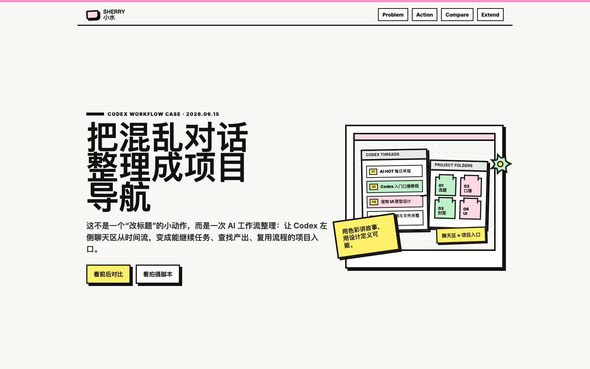

### 02. Blush Editorial / 暖粉编辑志

适合品牌感、编辑感更强的内容页面，比如工具推荐、清单整理、内容目录、产品介绍。

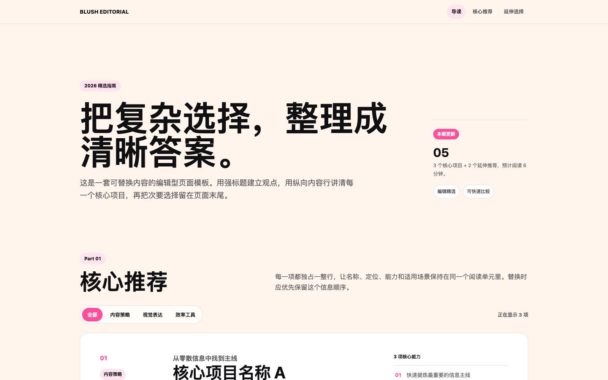

### 03. Mono Curve Slides / 墨线白稿

适合像 PPT 一样讲内容：上方可以做卡片预览，点开后进入独立幻灯片页面。

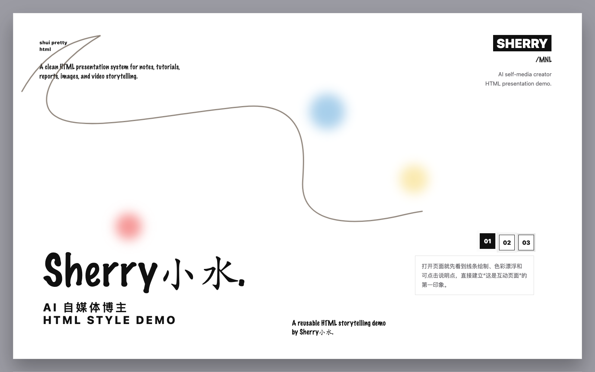

### 04. One Dot Cinnabar / 一点丹红

适合正式场合的汇报页面，比如年终总结、项目复盘、领导汇报、部门工作汇报。

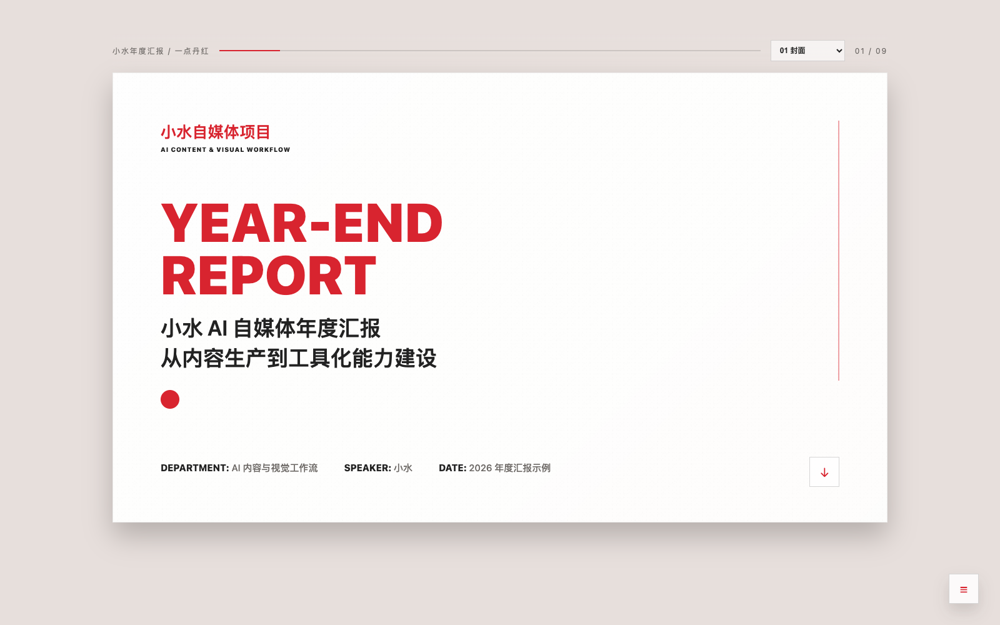

### 05. Ivory Research Deck / 象牙研稿

适合学术、研究和正式汇报场景：用象牙白纸面、浅蓝信息块、细线表格和时间轴承载高密度内容。

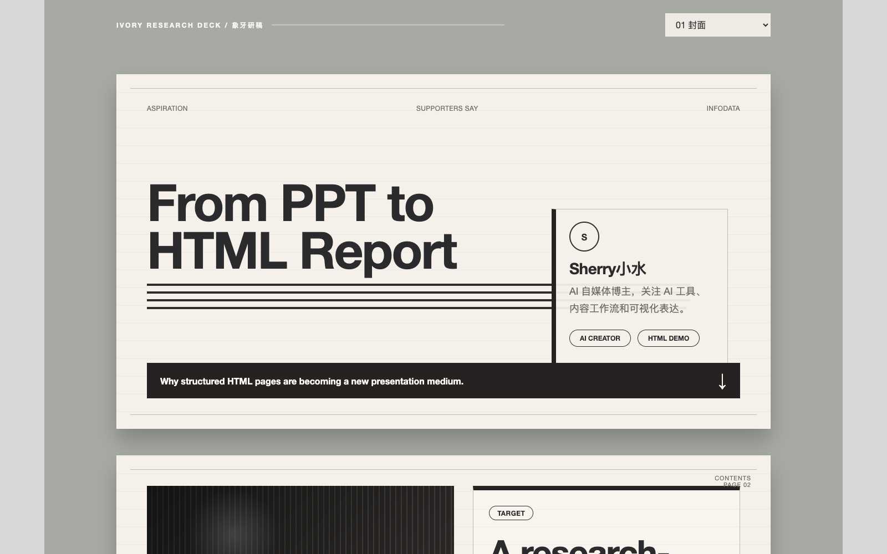

### 06. Cobalt Executive Deck / 钴蓝商策

适合商务汇报、产品介绍、公司介绍和合作提案。

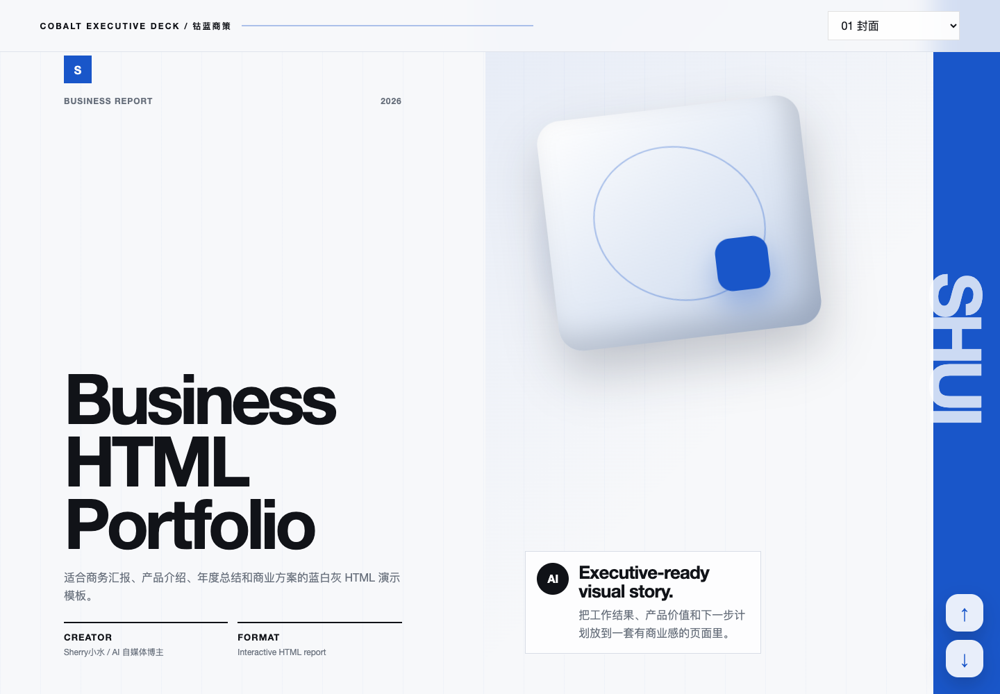

### 07. Coral Startup Deck / 珊瑚企简

适合更温暖、更有亲和力的公司介绍、项目汇报、团队路演和工作计划。

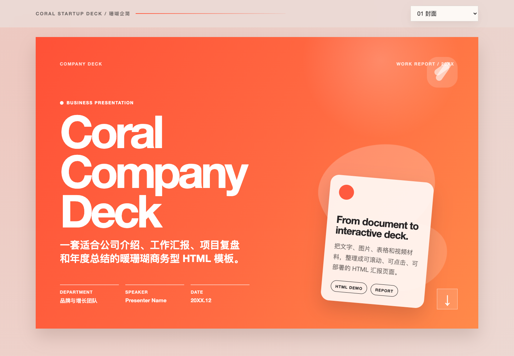

### 08. Ribbon Tab Brochure / 彩签页报

适合全屏项目资料册、产品说明、运营复盘和对外提案。

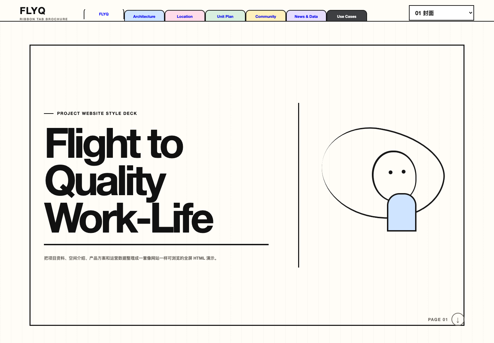

### 09. Sapphire Defense Deck / 宝蓝答辩稿

适合论文答辩、研究汇报和正式项目复盘。

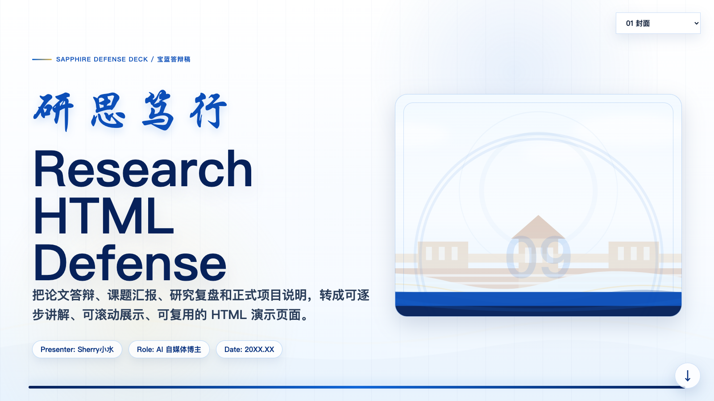

### 10. Vermilion Civic Deck / 红色汇报稿

适合政务、行政、党建和公共服务类正式汇报。

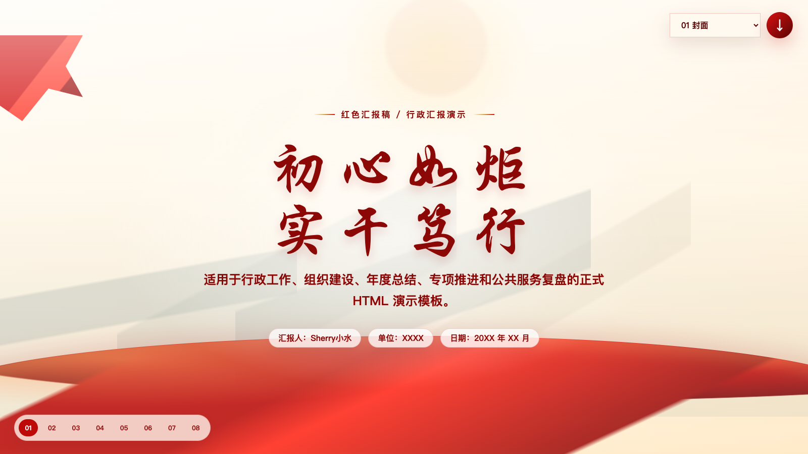

### 11. Blue Growth Deck / 蓝色增长稿

适合 AI 产品、运营增长、GEO 复盘和轻商务互动演示。

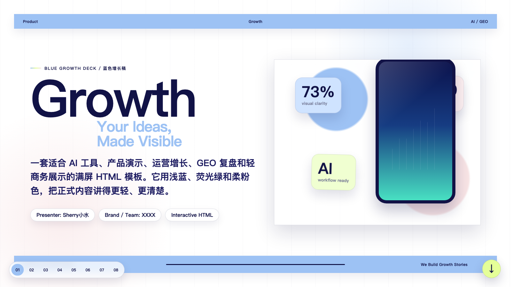

### 12. Garden Pop Landing / 花园跳色长页

适合自媒体教程、课程产品、创作者发布和轻快产品长页。

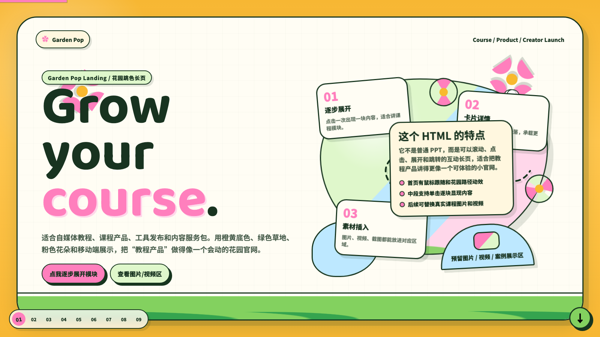

## What It Can Do

Shui Pretty PPT 可以帮助 Coding Agent：

- 读取用户提供的文字、Markdown、飞书文档内容、图片、截图、视频素材。
- 判断内容更适合哪一种 PPT 模板。
- 把长文档拆成 cover、agenda、chapter、data、process、comparison、image、summary、closing 等演示页。
- 生成可以直接打开的静态 HTML 网页 PPT。
- 保留每套模板自己的配色、字体层级、版式节奏和交互动效。
- 根据内容长度决定应该做成几页，而不是把所有内容硬塞进一屏。

## How To Use

在 Codex 里可以这样调用：

```text
使用 $shui-pretty-ppt，把这份文档做成一个适合晚上分享的 HTML 网页 PPT。
请根据内容自动选择最合适的模板。
```

指定模板：

```text
使用 $shui-pretty-ppt 的 Cobalt Executive Deck / 钴蓝商策，
把这份产品介绍做成商务汇报型网页 PPT。
```

复制模板到本地输出目录：

```bash
python3 skills/shui-pretty-ppt/scripts/copy_template.py cobalt-executive-deck /tmp/shui-cobalt-demo --force
open /tmp/shui-cobalt-demo/index.html
```

## Install

### Manual install for Codex

复制 skill 目录到 Codex skills 目录：

```bash
mkdir -p ~/.codex/skills
cp -R skills/shui-pretty-ppt ~/.codex/skills/shui-pretty-ppt
```

然后重启 Codex，让新 skill 生效。

### Install from GitHub

公开仓库后，可使用 `skills` CLI 安装：

```bash
npx -y skills@latest add XshuiAi/shui-pretty-ppt \
  --skill shui-pretty-ppt \
  --agent codex \
  --global
```

## Repository Structure

```text
shui-pretty-ppt/
├── README.md
├── assets/
│   └── previews/                 # README preview images
└── skills/
    └── shui-pretty-ppt/          # Codex skill source
        ├── SKILL.md
        ├── agents/openai.yaml
        ├── references/
        │   ├── ppt-template-catalog.md
        │   ├── style-index.md
        │   └── *.md              # detailed style specs
        ├── scripts/copy_template.py
        └── assets/templates/      # reusable HTML PPT template sources
```

## Design Principle

这个 skill 使用 progressive disclosure 的结构：

- `SKILL.md` 只保留核心工作流和风格选择规则。
- `references/ppt-template-catalog.md` 负责模板分类和选择。
- 每个模板的详细设计规范放在 `references/`。
- 可复用 HTML 源文件放在 `assets/templates/`。
- 复制模板使用脚本完成，避免每次都让模型从零重写。

这样做可以减少上下文消耗，也能让每一种 PPT 风格长期保持一致。
